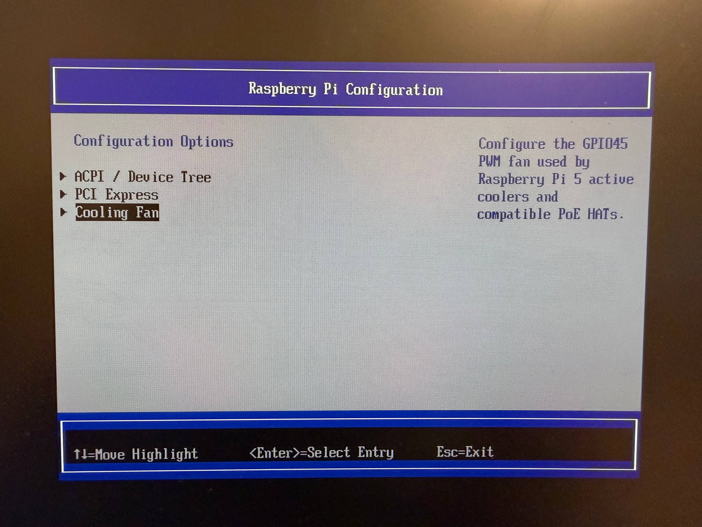
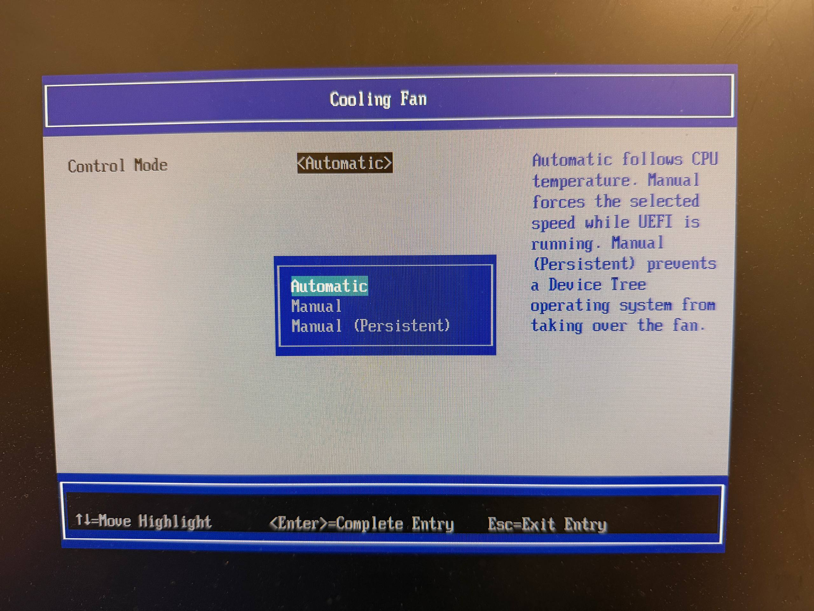
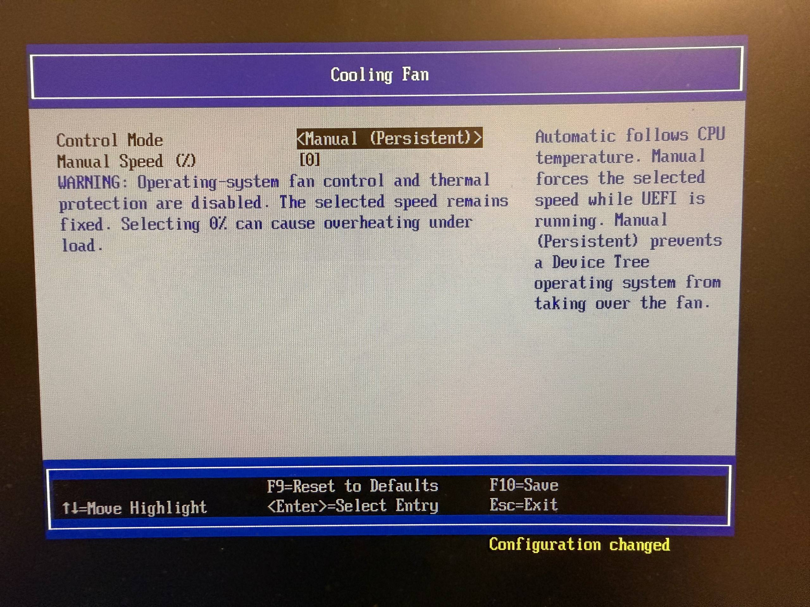

# Raspberry Pi 5 UEFI: ESXi network ACPI + Waveshare PoE HAT (F) Rev1.2 + Fan Control

[English](#english) | [Русский](#русский) | [Releases](https://github.com/Soulveig/rpi5-uefi-esxi-fan/releases)

## Screenshots / Скриншоты

<table>
  <tr>
    <td width="33%"></td>
    <td width="33%"></td>
    <td width="33%"></td>
  </tr>
  <tr>
    <td align="center">Cooling Fan menu / Меню Cooling Fan</td>
    <td align="center">Automatic, Manual and Manual Persistent modes / Режимы управления</td>
    <td align="center">Manual Persistent warning / Предупреждение режима Manual Persistent</td>
  </tr>
</table>

## English

Experimental UEFI build for Raspberry Pi 5, tested with VMware ESXi Arm and a Waveshare PoE HAT (F) Rev1.2 with one three-wire fan.

Ready-to-use image: [`firmware/RPI_EFI.fd`](firmware/RPI_EFI.fd). GitHub Releases use the same required filename: `RPI_EFI.fd`.

No D0 image is currently published. A D0-labelled artifact will be added only after a separate build and hardware boot test.

### Validation status

| Capability | Status | Scope |
|---|---|---|
| UEFI boot | **Verified** | Raspberry Pi 5, non-D0 |
| Keyboard and boot-disk operation | **Verified** | Tested UEFI/ESXi boot media |
| ESXi Arm boot | **Verified** | ESXi Arm 8.0U3c build 24449057 |
| Automatic fan control | **Verified** | Waveshare PoE HAT (F) Rev1.2 |
| Manual fan speeds | **Verified** | Distinguishable PWM speed levels |
| Manual Persistent at 100% | **Verified** | Fan remains active after ESXi startup |
| microSD access from UEFI | **Verified** | Card is exposed as a filesystem after the BCM2712 CMD6 workaround |
| UEFI setting persistence | **Verified** | Settings survive reboot and complete power removal after a normal reset/boot path |
| RP1 Ethernet ACPI resources | **Verified** | `RPI0001` GEM plus separate `RPI0002` GPIO diagnostics |
| Sustained RX and TX | **Verified** | Separate experimental `RP1_GEM` ESXi driver on this ACPI layout |

The firmware exposes the hardware resources required by the ESXi driver. Packet processing itself is implemented by the separate experimental ESXi driver, not by UEFI.

#### microSD and UEFI settings

The BCM2712 SDHCI controller may report a spurious response CRC/index error for SD `CMD6` after entering 4-bit mode. This build applies a command-specific workaround while retaining data CRC validation and normal response validation for every other command. The boot microSD is consequently exposed to UEFI, allowing the variable service to update the NVRAM area stored inside `RPI_EFI.fd`.

Settings are committed when UEFI reaches its normal `ReadyToBoot` path. Do not remove power immediately after saving settings in the setup menu. Continue booting or reset once first; subsequent reboots and complete power cycles preserve the saved values.

### Improvements

#### Network

- preserves the working RP1 Ethernet ACPI layout from the tested v0.8 build;
- exposes the GEM controller as `RPI0001`, with one `RP1_ETH_BASE` MMIO range of `0x10000` bytes and an interrupt;
- exposes the diagnostic GPIO range as a separate `RPI0002` device, with an `RP1_IO_BANK0_BASE` range of `0x30000` bytes;
- keeps the fan implementation isolated from Ethernet: it does not modify Ethernet ACPI, Ethernet clocks, GPIO32, GEM, or PHY logic.

This is the ACPI foundation used by the experimental RP1 Ethernet driver for ESXi, not a universal UEFI network driver. Sustained RX and TX were verified with the separate `RP1_GEM` ESXi driver; that result is specific to the tested firmware, driver and host configuration.

#### Fan control

Three modes are available in the platform settings menu:

`Device Manager → Raspberry Pi Configuration → Cooling Fan`

- **Automatic** — automatic fan curve based on SoC temperature;
- **Manual (0–100%)** — the selected speed remains active until control is handed over to the operating system;
- **Manual Persistent (0–100%)** — UEFI leaves the last programmed PWM state active after the operating system starts.

| Mode | While UEFI is running | At `ExitBootServices` | After OS startup |
|---|---|---|---|
| Automatic | UEFI follows the SoC temperature curve | Timer stops; saved hardware state is restored | The OS driver may take control |
| Manual | UEFI forces the selected speed | Saved hardware state is restored | The OS driver may take control |
| Manual Persistent | UEFI forces the selected speed | The programmed PWM state is retained | Fixed speed remains until another driver or reset changes it |

Automatic fan curve:

| Temperature | Fan speed |
|---|---:|
| below 50 °C | 0% |
| from 50 °C | 30% |
| from 60 °C | 50% |
| from 67.5 °C | 70% |
| from 75 °C | 100% |

A 5 °C downward hysteresis is used. UEFI timer updates stop at `ExitBootServices`.

In Automatic and standard Manual modes, the firmware restores the saved PWM1 clock, GPIO45, pad, PWM channel, and global PWM state. In Manual Persistent mode, the last programmed state is intentionally retained for an operating system that does not yet have a driver for this fan.

> **Warning:** Manual Persistent hands an already configured hardware state to the operating system and does not provide further thermal regulation. Select a sufficient fixed speed and monitor the temperature. For everyday Raspberry Pi OS use, Automatic control by the operating-system driver is recommended.

### Verified configuration

- Raspberry Pi 5 (non-D0);
- Waveshare PoE HAT (F) Rev1.2 with one three-wire fan;
- UEFI and ESXi Arm boot;
- Automatic mode changes fan speed;
- Manual mode produces distinguishable speed levels;
- ESXi boots with Manual Persistent set to 100%, and the fan continues running.

### Installation

1. Back up the current `RPI_EFI.fd` on the boot media.
2. Replace it with [`firmware/RPI_EFI.fd`](firmware/RPI_EFI.fd).
3. Verify its SHA-256 checksum using [`SHA256SUMS`](SHA256SUMS).
4. On the first boot, verify keyboard input, boot-disk detection, and temperature before running a long ESXi test.

Always keep a known-good rollback image. This is an experimental build and should not be installed without physical access to the Raspberry Pi.

### Releases

Only hardware-tested firmware is published in [GitHub Releases](https://github.com/Soulveig/rpi5-uefi-esxi-fan/releases). Experimental images are tested locally first and are not uploaded to GitHub.

### Upstream base

The build is based on the following branches and pinned commits:

- [NumberOneGit/rpi5-uefi, branch `master`](https://github.com/NumberOneGit/rpi5-uefi/tree/master) — [`ba315b63ffc778b633911416c0adedfc2a2763a7`](https://github.com/NumberOneGit/rpi5-uefi/commit/ba315b63ffc778b633911416c0adedfc2a2763a7);
- [worproject/arm-trusted-firmware, branch `rpi5`](https://github.com/worproject/arm-trusted-firmware/tree/rpi5) — [`682607fbd775e37fb5631508434dab9e60220c9a`](https://github.com/worproject/arm-trusted-firmware/commit/682607fbd775e37fb5631508434dab9e60220c9a);
- [Marcinoo97/edk2, branch `sdmmc-dev`](https://github.com/Marcinoo97/edk2/tree/sdmmc-dev) — [`118e09ed80f4d9ec9966c3d1ac9f5ec7c9f99880`](https://github.com/Marcinoo97/edk2/commit/118e09ed80f4d9ec9966c3d1ac9f5ec7c9f99880);
- [NumberOneGit/edk2-platforms, branch `rpi5-dev`](https://github.com/NumberOneGit/edk2-platforms/tree/rpi5-dev) — [`5654030569418c46e5a46066c495d4fad852b4f8`](https://github.com/NumberOneGit/edk2-platforms/commit/5654030569418c46e5a46066c495d4fad852b4f8);
- [tianocore/edk2-non-osi, branch `master`](https://github.com/tianocore/edk2-non-osi/tree/master) — [`1f4d7849f2344aa770f4de5224188654ae5b0e50`](https://github.com/tianocore/edk2-non-osi/commit/1f4d7849f2344aa770f4de5224188654ae5b0e50).

Compiler used for the tested build: Arm GNU Toolchain GCC 12.3.1 for macOS.

### Licenses

The original documentation in this repository is licensed under [`BSD-2-Clause-Patent`](LICENSE). The firmware combines components from multiple upstream projects whose original licenses remain applicable; see [`UPSTREAM.md`](UPSTREAM.md) and [`LICENSES/`](LICENSES/). This repository does not replace or override the licenses of the firmware components.

---

## Русский

Экспериментальная сборка UEFI для Raspberry Pi 5, проверенная с VMware ESXi Arm и Waveshare PoE HAT (F) Rev1.2 с одним трёхпроводным вентилятором.

Готовый образ: [`firmware/RPI_EFI.fd`](firmware/RPI_EFI.fd). В GitHub Releases используется то же обязательное имя: `RPI_EFI.fd`.

Образ D0 пока не публикуется. Файл с маркировкой D0 будет добавлен только после отдельной сборки и аппаратной проверки загрузки.

### Статус проверки

| Возможность | Статус | Область проверки |
|---|---|---|
| Загрузка UEFI | **Проверено** | Raspberry Pi 5, не D0 |
| Клавиатура и загрузочный диск | **Проверено** | Проверенный носитель UEFI/ESXi |
| Загрузка ESXi Arm | **Проверено** | ESXi Arm 8.0U3c build 24449057 |
| Автоматическое управление вентилятором | **Проверено** | Waveshare PoE HAT (F) Rev1.2 |
| Ручные скорости | **Проверено** | Различимые уровни PWM |
| Manual Persistent 100% | **Проверено** | Вентилятор продолжает работать после запуска ESXi |
| Доступ к microSD из UEFI | **Проверено** | Карта публикуется как файловая система после обхода CMD6 для BCM2712 |
| Сохранение настроек UEFI | **Проверено** | Настройки переживают перезагрузку и полное снятие питания после штатного reset/boot |
| ACPI-ресурсы RP1 Ethernet | **Проверено** | GEM `RPI0001` и отдельная диагностика GPIO `RPI0002` |
| Постоянные RX и TX | **Проверено** | Отдельный экспериментальный драйвер ESXi `RP1_GEM` на этой ACPI-разметке |

Прошивка публикует аппаратные ресурсы, необходимые драйверу ESXi. Обработка пакетов реализована отдельным экспериментальным драйвером ESXi, а не UEFI.

#### microSD и настройки UEFI

Контроллер SDHCI в BCM2712 может ошибочно сообщать CRC/Index Error ответа SD-команды `CMD6` после перехода в четырёхбитный режим. В этой сборке применяется обход только для данной команды; проверка CRC данных и обычная проверка ответов всех остальных команд сохранены. Благодаря этому загрузочная microSD доступна в UEFI, а служба переменных может обновлять область NVRAM внутри `RPI_EFI.fd`.

Настройки записываются при достижении UEFI штатного этапа `ReadyToBoot`. Не отключайте питание сразу после сохранения в меню настроек: сначала продолжите загрузку либо один раз выполните reset. После этого сохранённые значения переживают последующие перезагрузки и полные отключения питания.

### Что улучшено

#### Сетевая часть

- сохранена рабочая ACPI-разметка RP1 Ethernet из проверенной сборки v0.8;
- контроллер GEM публикуется как `RPI0001`: один MMIO-диапазон `RP1_ETH_BASE` размером `0x10000` и прерывание;
- диагностический GPIO-диапазон вынесен в отдельное устройство `RPI0002`: `RP1_IO_BANK0_BASE` размером `0x30000`;
- реализация вентилятора изолирована от Ethernet: она не меняет ACPI-сетевую часть, тактирование Ethernet, GPIO32, GEM или PHY.

Это ACPI-основа экспериментального драйвера RP1 Ethernet для ESXi, а не универсальный сетевой драйвер UEFI. Постоянные RX и TX проверены с отдельным драйвером ESXi `RP1_GEM`; результат относится к проверенному сочетанию прошивки, драйвера и хоста.

#### Управление вентилятором

В меню настроек платформы доступны три режима:

`Device Manager → Raspberry Pi Configuration → Cooling Fan`

- **Automatic** — автоматическая кривая по температуре SoC;
- **Manual (0–100%)** — заданная скорость действует до передачи управления ОС;
- **Manual Persistent (0–100%)** — UEFI оставляет последнее состояние PWM после запуска ОС.

| Режим | Во время работы UEFI | При `ExitBootServices` | После запуска ОС |
|---|---|---|---|
| Automatic | UEFI использует температурную кривую SoC | Таймер останавливается, исходное состояние оборудования восстанавливается | Управление может принять драйвер ОС |
| Manual | UEFI принудительно задаёт выбранную скорость | Исходное состояние оборудования восстанавливается | Управление может принять драйвер ОС |
| Manual Persistent | UEFI принудительно задаёт выбранную скорость | Запрограммированное состояние PWM сохраняется | Фиксированная скорость действует, пока её не изменит драйвер или сброс |

Автоматическая кривая:

| Температура | Скорость |
|---|---:|
| ниже 50 °C | 0% |
| от 50 °C | 30% |
| от 60 °C | 50% |
| от 67,5 °C | 70% |
| от 75 °C | 100% |

При снижении температуры используется гистерезис 5 °C. Обновление от таймера UEFI прекращается при `ExitBootServices`.

В режимах Automatic и обычном Manual прошивка восстанавливает сохранённое состояние PWM1, GPIO45, pad, канала и глобальных регистров PWM. В режиме Manual Persistent последнее запрограммированное состояние намеренно сохраняется для ОС, в которой пока нет драйвера этого вентилятора.

> **Предупреждение:** Manual Persistent передаёт ОС уже настроенное аппаратное состояние и не выполняет дальнейшую терморегуляцию. Выбирайте достаточную постоянную скорость и контролируйте температуру. Для повседневной Raspberry Pi OS рекомендуется Automatic с управлением драйвером ОС.

### Проверенная конфигурация

- Raspberry Pi 5 (не D0);
- Waveshare PoE HAT (F) Rev1.2, один трёхпроводный вентилятор;
- запуск UEFI и ESXi Arm;
- Automatic изменяет скорость вентилятора;
- Manual даёт различимые уровни скорости;
- ESXi загружается при Manual Persistent 100%, вентилятор продолжает работать.

### Установка

1. Сохраните резервную копию текущего `RPI_EFI.fd` на загрузочном носителе.
2. Скопируйте [`firmware/RPI_EFI.fd`](firmware/RPI_EFI.fd) вместо текущего файла.
3. Проверьте SHA-256 по файлу [`SHA256SUMS`](SHA256SUMS).
4. При первом запуске проверьте клавиатуру, загрузочный диск и температуру до длительного теста ESXi.

Всегда держите рабочий образ для отката. Сборка экспериментальная и не предназначена для установки без физического доступа к Raspberry Pi.

### Релизы

В [GitHub Releases](https://github.com/Soulveig/rpi5-uefi-esxi-fan/releases) публикуются только прошедшие аппаратную проверку прошивки. Экспериментальные образы сначала проверяются локально и не загружаются на GitHub.

### Исходная основа

Сборка создана на основе следующих веток и зафиксированных коммитов:

- [NumberOneGit/rpi5-uefi, ветка `master`](https://github.com/NumberOneGit/rpi5-uefi/tree/master) — [`ba315b63ffc778b633911416c0adedfc2a2763a7`](https://github.com/NumberOneGit/rpi5-uefi/commit/ba315b63ffc778b633911416c0adedfc2a2763a7);
- [worproject/arm-trusted-firmware, ветка `rpi5`](https://github.com/worproject/arm-trusted-firmware/tree/rpi5) — [`682607fbd775e37fb5631508434dab9e60220c9a`](https://github.com/worproject/arm-trusted-firmware/commit/682607fbd775e37fb5631508434dab9e60220c9a);
- [Marcinoo97/edk2, ветка `sdmmc-dev`](https://github.com/Marcinoo97/edk2/tree/sdmmc-dev) — [`118e09ed80f4d9ec9966c3d1ac9f5ec7c9f99880`](https://github.com/Marcinoo97/edk2/commit/118e09ed80f4d9ec9966c3d1ac9f5ec7c9f99880);
- [NumberOneGit/edk2-platforms, ветка `rpi5-dev`](https://github.com/NumberOneGit/edk2-platforms/tree/rpi5-dev) — [`5654030569418c46e5a46066c495d4fad852b4f8`](https://github.com/NumberOneGit/edk2-platforms/commit/5654030569418c46e5a46066c495d4fad852b4f8);
- [tianocore/edk2-non-osi, ветка `master`](https://github.com/tianocore/edk2-non-osi/tree/master) — [`1f4d7849f2344aa770f4de5224188654ae5b0e50`](https://github.com/tianocore/edk2-non-osi/commit/1f4d7849f2344aa770f4de5224188654ae5b0e50).

Компилятор проверенной сборки: Arm GNU Toolchain GCC 12.3.1 для macOS.

### Лицензии

Собственная документация этого репозитория опубликована под лицензией [`BSD-2-Clause-Patent`](LICENSE). Прошивка объединяет компоненты нескольких upstream-проектов, лицензии которых продолжают действовать; ссылки и уведомления приведены в [`UPSTREAM.md`](UPSTREAM.md) и [`LICENSES/`](LICENSES/). Этот репозиторий не заменяет и не переопределяет лицензии компонентов прошивки.
